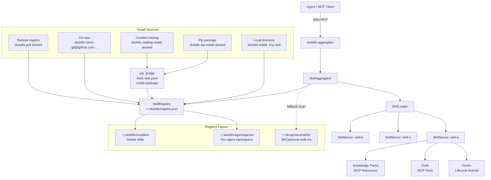

# skskills — Sovereign Agent Skills Framework

[](https://pypi.org/project/skskills/)
[](https://www.npmjs.com/package/@smilintux/skskills)
[](LICENSE)
[](https://pypi.org/project/skskills/)

**SKSkills** is an MCP-native skill management framework for sovereign AI agents. It lets you scaffold, install, and serve modular agent capabilities — called *skills* — that extend any MCP-compatible agent runtime. Each skill bundles one or more of three primitives: **Knowledge** (context files served as MCP resources), **Tools** (executable functions registered as MCP tools), and **Hooks** (event-driven scripts that fire on agent lifecycle events). The `skskills-aggregator` process loads all installed skills and presents them through a single unified MCP endpoint, making the entire skill library available to any agent that connects over stdio. No monolithic configuration, no git submodules — just independent packages wired together by the aggregator.

---

## Install

```bash
# Python — CLI + runtime (requires Python ≥ 3.10)
pip install skskills

# with optional CapAuth PGP signature verification
pip install "skskills[capauth]"

# npm — catalog helper / JavaScript ecosystem
npm install -g @smilintux/skskills
```

---

## Architecture



**Discovery priority** (highest first):

1. Per-agent registry — `~/.skskills/agents/<agent>/`
2. Global registry — `~/.skskills/installed/`
3. SKCapstone built-ins — `~/.skcapstone/skills/`

Agent-specific skills override global and skcapstone skills with the same name. All resolved tools are exposed as `<skill-name>.<tool-name>` (e.g. `syncthing-setup.check_status`), guaranteeing namespace uniqueness across the full skill set.

---

## Features

- **Three skill primitives** — Knowledge (MCP resources), Tools (MCP tools), and Hooks (lifecycle event bindings) all declared in a single `skill.yaml` manifest validated by Pydantic
- **Aggregator MCP server** — `skskills-aggregator` multiplexes all installed skills behind one stdio MCP endpoint; no per-skill wiring required
- **Multi-agent namespacing** — skills are scoped globally or to a named agent (`jarvis`, `lumina`, …); symlinks let global skills be shared into agent namespaces without duplication
- **Pip-bridge install** — skills shipped as Python packages embed `skill.yaml` inside the package; `skskills pip-install <pkg>` runs pip and auto-registers the bundled manifest
- **Curated catalog** — `catalog.yaml` bundled in the package lists first-party smilintux-org skills with pip/npm/git coordinates for one-command installs
- **Remote registry** — `pull`, `push`, `publish`, `package`, and `clone` commands share skills via a community hub
- **Enable / disable without uninstall** — skills can be toggled off at runtime; the aggregator respects status stored in `registry.json`
- **Health and collision reporting** — per-skill `ok / degraded / error` status, unresolved tool tracking, and tool base-name collision detection all exposed as MCP tools
- **CapAuth signatures** — optional PGP `signature` and `signed_by` in `skill.yaml` for verifiable author identity
- **Flexible entrypoints** — tool and hook entrypoints can be Python dotpaths (`tools.deploy:run`), file paths (`tools/greet.py:run`), or executable shell scripts; hooks support `async` and `cron` scheduling

---

## Usage

### CLI quick-reference

```bash
# Scaffold a new skill project
skskills init my-skill --author "Your Name" --description "What it does"

# Install from a local directory
skskills install ./my-skill
skskills install ./my-skill --agent jarvis      # scope to an agent

# Install from a pip package (runs pip install, then registers)
skskills pip-install skseed
skskills pip-install skcapstone --agent lumina
skskills pip-install skseed --no-pip            # already installed, just register

# Browse and install from the curated catalog
skskills catalog list
skskills catalog list --category core
skskills catalog info skseed
skskills catalog search "logic"
skskills catalog install skseed

# Pull from the remote community registry
skskills remote-search syncthing
skskills pull syncthing-setup
skskills pull syncthing-setup --version 0.2.0 --agent jarvis

# Install from a git repository
skskills clone https://github.com/smilinTux/skseed.git

# Manage installed skills
skskills list
skskills list --agent jarvis
skskills info my-skill
skskills search "transport"

# Enable / disable without uninstalling
skskills enable my-skill
skskills disable my-skill

# Link a global skill into an agent's namespace
skskills link my-skill jarvis

# Update a skill from an updated source directory
skskills update my-skill ./my-skill-v2

# Remove a skill
skskills uninstall my-skill
skskills uninstall my-skill --agent jarvis -y   # skip confirmation

# Package and publish to the remote registry
skskills package ./my-skill -o ./dist
skskills publish ./my-skill --token $SKSKILLS_TOKEN
```

### Starting the aggregator MCP server

```bash
# Serve all globally installed skills via MCP on stdio
skskills run

# Serve skills for a specific agent
skskills run --agent jarvis

# Or use the standalone entry-point directly
skskills-aggregator
skskills-aggregator --agent jarvis
skskills-aggregator --agent opus --log-level DEBUG
```

Add to your agent's MCP server configuration (e.g. Claude Code `~/.claude/settings.json`):

```json
{
  "mcpServers": {
    "skskills": {
      "command": "skskills-aggregator",
      "args": ["--agent", "global"]
    }
  }
}
```

### Python API

```python
from pathlib import Path
from skskills.registry import SkillRegistry
from skskills.aggregator import SkillAggregator
from skskills.catalog import SkillCatalog
from skskills.pip_bridge import find_pip_skill, list_pip_skills
import asyncio

# Query the local registry
registry = SkillRegistry()
skills = registry.list_skills()                     # all agents
skills = registry.list_skills("jarvis")             # one agent
skill  = registry.get("skseed", "global")           # single skill
found  = registry.search("syncthing", agent=None)   # fuzzy search

# Install programmatically
installed = registry.install(Path("./my-skill"), agent="jarvis")
print(installed.manifest.name, installed.manifest.version)

# Load and run the aggregator
agg = SkillAggregator(agent="jarvis")
count = agg.load_all_skills()
print(f"{count} skills loaded")
asyncio.run(agg.run_stdio())          # starts MCP server on stdio

# Query the curated catalog
cat = SkillCatalog()
entry = cat.get("skseed")
print(entry.install_hint)             # "skskills pip-install skseed"
results = cat.search("logic")
pip_skills = cat.pip_installable()

# Discover skill.yaml bundled in pip packages
path = find_pip_skill("skseed")       # Path to skill.yaml, or None
all_found = list_pip_skills()         # [(pkg_name, skill_yaml_path), ...]
```

### skill.yaml manifest reference

```yaml
name: my-skill          # kebab-case, required, unique
version: 0.1.0
description: "What this skill provides to agents."
author:
  name: "Your Name"
  email: "you@example.com"
  fingerprint: ""       # CapAuth PGP fingerprint (optional)

knowledge:
  - path: knowledge/SKILL.md
    description: "Core context document"
    auto_load: true       # inject into agent context on startup
    mime_type: text/markdown

tools:
  - name: check_status
    description: "Check the current service status"
    entrypoint: "tools/check.py:run"  # file:func, dotpath:func, or script path
    timeout_s: 30
    requires_confirmation: false
    input_schema:
      type: object
      properties:
        verbose: {type: boolean, description: "Include detailed output"}
      required: []

hooks:
  - event: on_boot
    entrypoint: "hooks/startup.py:run"
    description: "Initialise state on agent boot"
    async: true
  - event: cron
    entrypoint: "hooks/daily.py:run"
    cron_schedule: "0 9 * * *"
    description: "Daily 9 am task"

dependencies:
  - name: skseed
    version: ">=0.1.0"
    type: skill
  - name: requests
    version: ">=2.28"
    type: python

tags: [sovereign, transport, core]
signature: ""           # CapAuth detached PGP signature (optional)
signed_by: ""
```

**Available hook events:**
`on_boot`, `on_shutdown`, `on_message_received`, `on_message_sent`, `on_memory_stored`, `on_task_completed`, `on_skill_installed`, `on_sync_pull`, `on_sync_push`, `cron`

---

## MCP Tools

The aggregator exposes the following built-in tools in addition to all tools declared by installed skills:

| Tool | Description |
|------|-------------|
| `skskills.list` | List all installed skills and their status. Accepts optional `agent` filter. |
| `skskills.skills` | List all *loaded* (active) skills with tool namespaces, health, and metadata. |
| `skskills.info` | Detailed manifest, tools, knowledge packs, and hooks for a named skill. |
| `skskills.run_tool` | Run any skill tool by its qualified name (`skill_name.tool_name`) with arguments. |
| `skskills.health` | Per-skill health report — `ok / degraded / error`, unresolved tools, load errors. Optional `skill` filter. |
| `skskills.collisions` | Report tool base-name collisions across loaded skills. Qualified names remain unique. |

Skill-contributed tools appear as `<skill-name>.<tool-name>` (e.g. `syncthing-setup.check_status`).
Knowledge packs are served as MCP resources at `skill://<skill-name>/<path>`.

---

## Configuration

### Environment variables

| Variable | Default | Description |
|----------|---------|-------------|
| `SKSKILLS_HOME` | `~/.skskills` | Root directory for the local registry |
| `SKCAPSTONE_HOME` | `~/.skcapstone` | Path to SKCapstone home (built-in skill discovery) |
| `SKSKILLS_TOKEN` | — | Bearer token for `skskills publish` to the remote registry |

### Registry layout

```
~/.skskills/
├── installed/                      # Global skill installs
│   └── my-skill/
│       ├── skill.yaml
│       ├── knowledge/
│       ├── tools/
│       └── hooks/
├── agents/                         # Per-agent namespaces
│   ├── jarvis/
│   │   ├── my-skill -> ../../installed/my-skill   # symlink (skskills link)
│   │   └── agent-only-skill/
│   └── lumina/
│       └── ...
└── registry.json                   # Installation index with status per skill
```

---

## Contributing / Development

```bash
# Clone and set up an editable dev install
git clone https://github.com/smilinTux/skskills.git
cd skskills
pip install -e ".[dev]"

# Run the test suite
pytest

# Run with coverage
pytest --cov=skskills --cov-report=term-missing

# Lint and format
ruff check src/
black src/
```

### Creating and publishing a skill

```bash
# 1. Scaffold
skskills init my-skill --author "Your Name"
cd my-skill

# 2. Edit skill.yaml, write entrypoints in tools/ and hooks/

# 3. Test locally
skskills install . --force
skskills info my-skill
skskills run

# 4. Package and publish
skskills package .
skskills publish . --token $SKSKILLS_TOKEN
```

To ship a skill as a pip package, bundle `skill.yaml` at `<package>/data/skill.yaml`:

```
my_skill/
├── __init__.py
└── data/
    ├── skill.yaml
    └── knowledge/
        └── SKILL.md
```

Users then install with `skskills pip-install my-skill`.

### Project layout

```
src/skskills/
├── __init__.py        # version constant, SKILLS_HOME
├── cli.py             # Click CLI — all skskills subcommands
├── models.py          # Pydantic models: SkillManifest, ToolDefinition, HookDefinition, …
├── registry.py        # SkillRegistry — install, uninstall, list, search, enable/disable
├── loader.py          # SkillLoader / SkillServer — entrypoint resolution, MCP wiring
├── aggregator.py      # SkillAggregator — unified MCP server (skskills-aggregator)
├── catalog.py         # SkillCatalog — query bundled catalog.yaml
├── pip_bridge.py      # Discover and register skill.yaml from pip packages
├── remote.py          # RemoteRegistry — pull/push/publish/clone to remote hub
└── catalog.yaml       # Curated first-party skill list
```

---

## Links

- Homepage: <https://skills.smilintux.org>
- Repository: <https://github.com/smilinTux/skskills>
- Issues: <https://github.com/smilinTux/skskills/issues>
- PyPI: <https://pypi.org/project/skskills/>
- npm: <https://www.npmjs.com/package/@smilintux/skskills>

---

*Licensed under [GPL-3.0-or-later](LICENSE). Part of the smilinTux.org sovereign agent ecosystem.*
