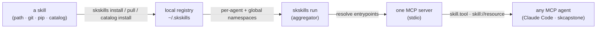
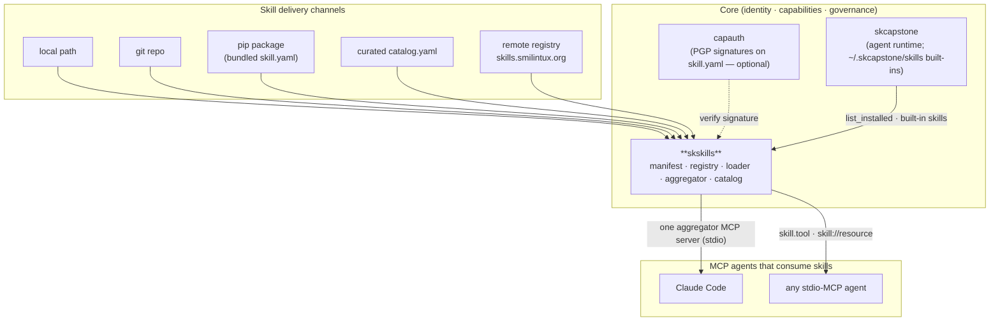

# skskills — Sovereign Agent Skills 🐧

> **Skills your agent owns — install, run, and share capabilities like packages,
> with one MCP socket for the whole fleet.** A skill is a self-describing bundle
> of *knowledge*, *tools*, and *hooks*; skskills installs them, namespaces them
> per agent, and proxies all of them through a single MCP server.

skskills is the **skills platform/registry** of the [SKWorld](https://skworld.io)
sovereign agent ecosystem — the MCP-native replacement for OpenClaw plugins. It
gives every capability the same shape (a `skill.yaml` manifest), the same
lifecycle (install → enable → load → run), and the same delivery channels (a
local path, a git repo, a pip package, or the curated catalog). Any
MCP-compatible agent — Claude Code, skcapstone, anything that speaks stdio MCP —
connects to **one** aggregator endpoint and sees every installed skill's tools.

**The core idea:** a skill declares *what* it provides (the three primitives
below); skskills resolves *how* — finds the entrypoint, namespaces the tool as
`skill.tool`, and serves it. You don't wire plugins into the agent; you install a
skill and the agent gains its tools.

---

## The 60-second version



Three primitives in every skill:

| Primitive | MCP shape | What it is |
|---|---|---|
| **Knowledge** | MCP **resource** (`skill://name/path`) | context files (SKILL.md, references) the agent can read; can `auto_load` on start |
| **Tool** | MCP **tool** (`skill.tool`) | an executable action — a Python dotpath/file (`tools/x.py:run`) or an executable script |
| **Hook** | lifecycle listener | event-driven script bound to `on_boot`, `on_message_received`, `cron`, … |

## Quickstart

```bash
pip install -e .                          # into the ~/.skenv venv  (project.scripts: skskills, skskills-aggregator)

skskills init my-skill --author "you"     # scaffold knowledge/ tools/ hooks/ + a starter skill.yaml
skskills install ./my-skill               # copy into the registry (global namespace)
skskills list                             # installed skills: version · agent · types · tools · signed
skskills run --agent lumina               # start the aggregator MCP server on stdio for that agent
```

Pull from anywhere:

```bash
skskills catalog list                     # browse the curated first-party catalog (catalog.yaml)
skskills catalog install skseed           # resolve pip/git coordinates and install
skskills pip-install skcapstone --agent lumina   # install a skill bundled inside a pip package
skskills clone https://github.com/smilinTux/skmemory   # install straight from a git repo
skskills pull skseal                      # download + install from the remote registry
```

Manage the fleet:

```bash
skskills info skseed                      # manifest detail: tools, knowledge, hooks, signature
skskills search logic                     # match installed skills by name / description / tag
skskills disable unhinged-mode            # keep installed but stop exposing its tools
skskills link skseed lumina               # symlink a global skill into an agent namespace
skskills package ./my-skill               # build a distributable tarball (+ SHA-256, metadata sidecar)
skskills publish ./my-skill --token …     # publish to the remote registry (CapAuth bearer)
```

## What skskills provides

| Piece | What it is |
|---|---|
| **`skill.yaml` manifest** | the Pydantic-validated skill schema — name, version, author, knowledge/tools/hooks, deps, optional CapAuth signature (`models.py`) |
| **Registry** | local-first install/uninstall/enable/disable/search with **per-agent + global namespaces** under `~/.skskills/` (`registry.py`) |
| **Loader** | resolves each tool/hook entrypoint to a callable (dotpath, `.py` file, or executable script) and wraps the skill as a `SkillServer` (`loader.py`) |
| **Aggregator** | one MCP server that discovers all enabled skills and proxies their tools/resources; reports health + tool-name collisions (`aggregator.py`) |
| **Catalog** | the curated first-party skill list (`catalog.yaml`) with pip/npm/git coordinates and `catalog install/info/search` (`catalog.py`) |
| **Remote** | publish/download/pull over an HTTP registry, install `from_git`, package to a checksummed tarball (`remote.py`) |
| **Pip bridge** | find a `skill.yaml` bundled inside an installed pip package and register it — skills ship as ordinary Python packages (`pip_bridge.py`) |
| **CLI** | `skskills` (Click + Rich) — the whole lifecycle from the terminal (`cli.py`) |

**Delivery channels (all converge on the same registry install):** local path ·
git repo · pip package · remote registry · curated catalog.

**Discovery order at load time** (agent overrides global): `~/.skskills/agents/<agent>/`
→ `~/.skskills/installed/` → `~/.skcapstone/skills/` (skcapstone built-ins). The
fully-qualified `skill.tool` name always stays unique, so proxying is unambiguous;
base-name overlaps are reported via `skskills.collisions`.

## Where it lives in SKStack v2

skskills is a **Core** capability — the capability-delivery layer for sovereign
agents. It is the platform primitive that turns the rest of the ecosystem (and any
third-party skill) into installable, namespaced, MCP-exposed tools. It is consumed
by **skcapstone** (which scans `~/.skcapstone/skills/` and uses the registry's
`list_installed` in its install wizard) and optionally verifies skill authenticity
through **capauth**.



See **[docs/ARCHITECTURE.md](docs/ARCHITECTURE.md)** for the install/load/serve
lifecycle, the entrypoint-resolution rules, the namespace + collision model, and
the full source map.

## A skill manifest

```yaml
name: my-skill
version: 0.1.0
description: What this skill does
author:
  name: you
  fingerprint: ""          # CapAuth PGP fingerprint — enables signature verification
knowledge:
  - path: knowledge/SKILL.md
    description: Core knowledge for my-skill
    auto_load: true
tools:
  - name: greet
    description: Say hello
    entrypoint: tools/greet.py:run     # dotpath, .py file, or executable script
    input_schema: { type: object, properties: {}, required: [] }
hooks:
  - event: on_boot
    entrypoint: hooks/boot.py:main
tags: [sovereign]
```

`skskills init` scaffolds this for you; the loader resolves each `entrypoint` to a
callable and the aggregator serves `my-skill.greet` as an MCP tool and
`skill://my-skill/knowledge/SKILL.md` as an MCP resource.

---

> *"An agent without skills is just a chatbot. Skills are what make it sovereign."*

Part of the **[SKWorld](https://skworld.io)** sovereign ecosystem · skills hub:
**[skills.smilintux.org](https://skills.smilintux.org)** · 🐧 smilinTux
