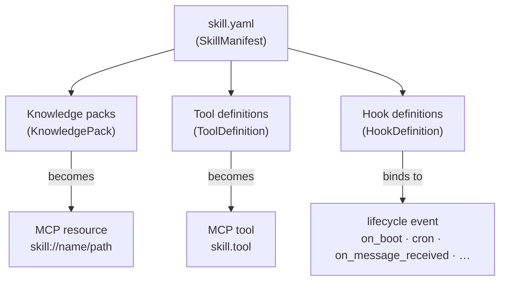
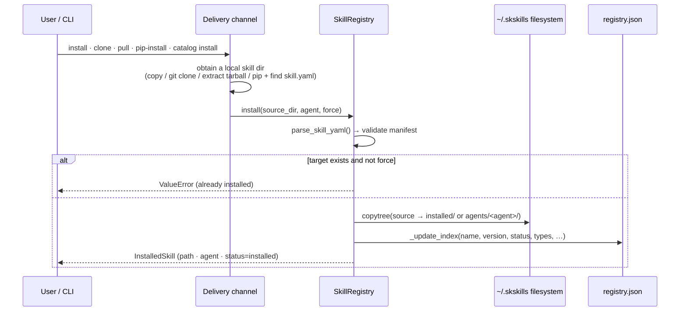
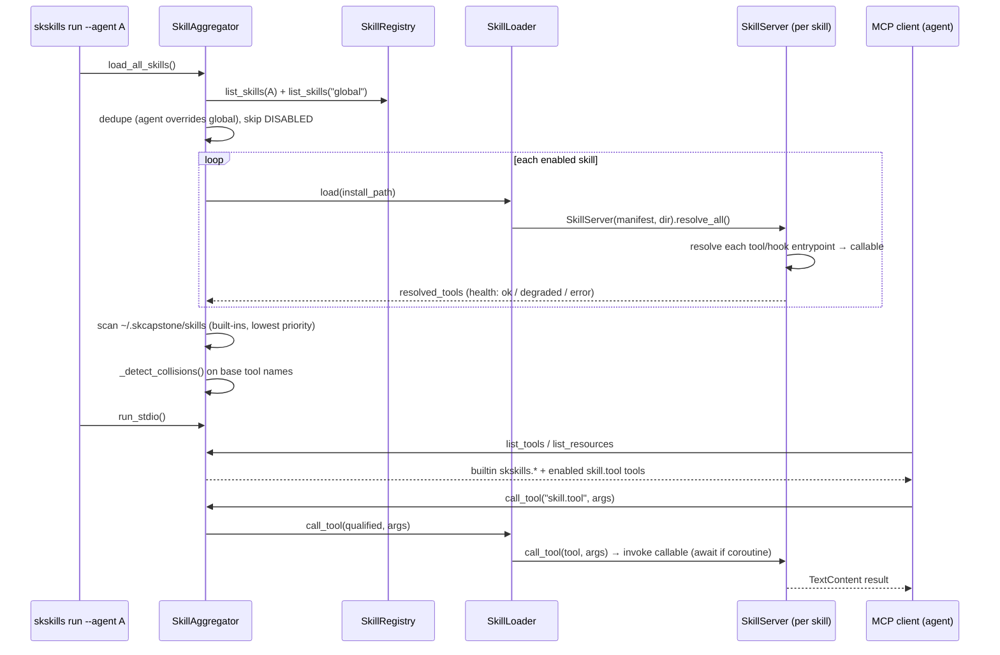
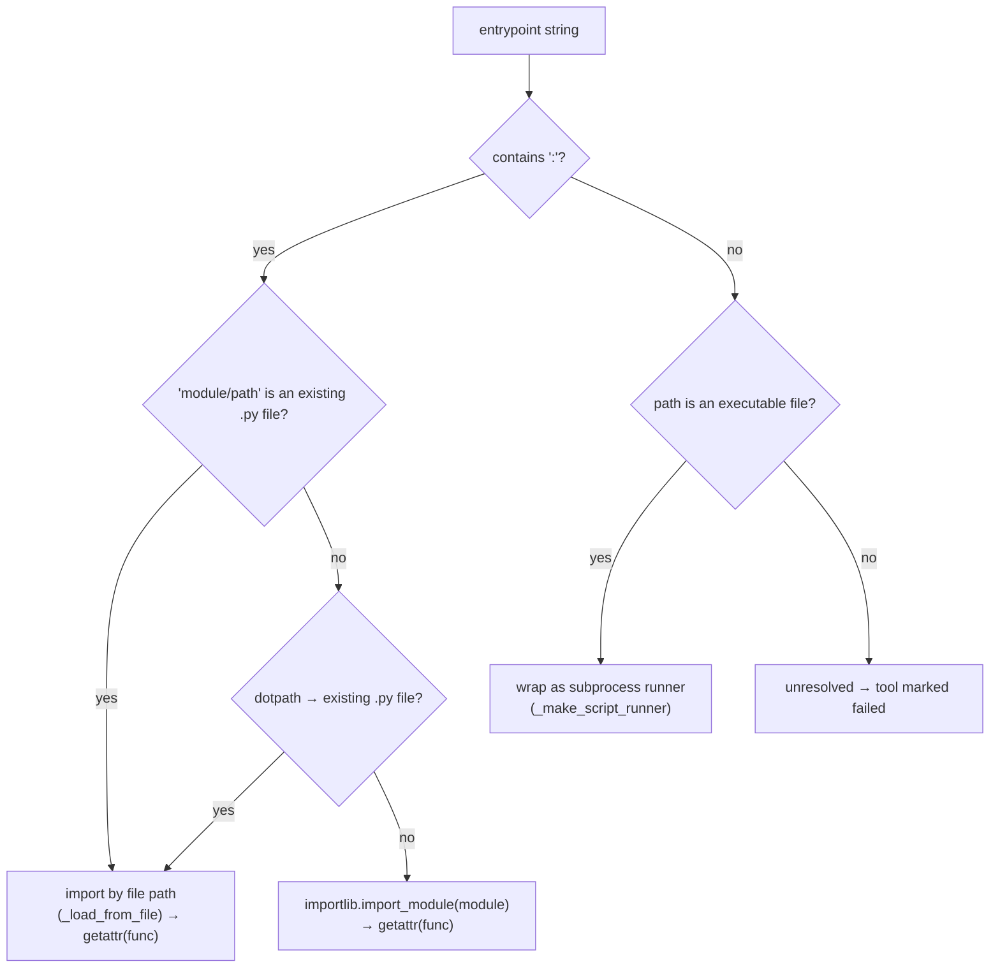
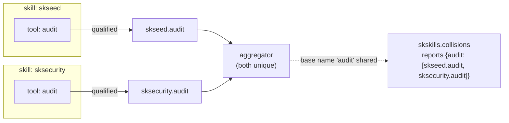
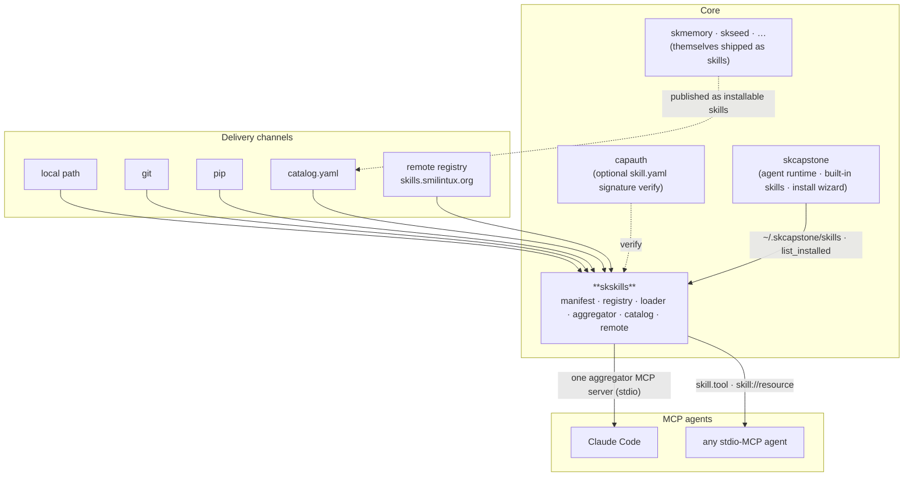

# skskills — Architecture

skskills is the **sovereign skills platform** for MCP-compatible agents. A *skill*
is a directory with a `skill.yaml` manifest and some payload (knowledge files, tool
scripts, hook scripts). skskills turns that directory into installable,
namespaced, MCP-served capabilities. This document explains the data model, the
install → load → serve lifecycle, entrypoint resolution, the namespace/collision
model, the delivery channels, and where it sits in SKWorld.

The whole system is local-first: the source of truth is the filesystem under
`~/.skskills/` (overridable with `SKSKILLS_HOME`), with a small `registry.json`
index for status/metadata.

---

## 1. The skill model — three primitives

Every skill declares zero or more of three primitive component types. They map
directly onto MCP concepts.



- **Knowledge** (`KnowledgePack`): a relative `path` to a context file, a
  `mime_type`, and an `auto_load` flag. Served as an MCP resource at
  `skill://<name>/<path>`.
- **Tool** (`ToolDefinition`): `name`, `description`, an `entrypoint`, a JSON-Schema
  `input_schema`, a `timeout_s`, and `requires_confirmation`. Registered as the MCP
  tool `<skill>.<tool>`.
- **Hook** (`HookDefinition`): an `event` from a fixed enum (`on_boot`,
  `on_shutdown`, `on_message_received`, `on_message_sent`, `on_memory_stored`,
  `on_task_completed`, `on_skill_installed`, `on_sync_pull`, `on_sync_push`,
  `cron`), an `entrypoint`, and an optional `cron_schedule`.

The manifest is a Pydantic model (`models.py`). Notable validation/derived behavior:

- **`name`** is forced to kebab-case and lowercased (`validate_name`).
- **`component_types`** is derived from which primitive lists are non-empty.
- **`tool_names`** yields the fully-qualified `<skill>.<tool>` identifiers.
- **`is_signed()`** is true when both `signature` and `signed_by` are set — the
  hook for optional **capauth** PGP verification of the manifest.

`parse_skill_yaml()` loads + validates a manifest; `generate_skill_yaml()`
serializes one back (used by `skskills init`).

---

## 2. Install lifecycle

Every delivery channel converges on the same registry install: a skill directory
(containing `skill.yaml`) is validated and **copied** into the registry, then
indexed.



**Delivery channels** (all end in `SkillRegistry.install`):

| Channel | CLI | Module | How it gets a local skill dir |
|---|---|---|---|
| Local path | `skskills install ./dir` | `registry.py` | direct |
| Git repo | `skskills clone <url>` | `remote.py` `from_git` | shallow clone (skill.yaml at root or one level deep) |
| Pip package | `skskills pip-install <pkg>` | `pip_bridge.py` | `pip install`, then find `<pkg>/data/skill.yaml` or `<pkg>/skill.yaml`, stage to temp dir |
| Remote registry | `skskills pull <name>` | `remote.py` | HTTP download tarball → checksum verify → extract |
| Curated catalog | `skskills catalog install <name>` | `catalog.py` + bridge | resolve coordinates → pip-install if `pip:`, else git clone |

**Registry layout** under `~/.skskills/`:

```
~/.skskills/
  installed/            # global namespace
    <skill-name>/skill.yaml + payload
  agents/
    <agent>/            # per-agent namespace
      <skill-name>/     # copied skill, or symlink to a global one (link_to_agent)
  cache/remote/         # downloaded tarballs + cached index.json
  registry.json         # index: "<agent>/<name>" → {version, status, path, types, …}
```

The registry index keys are `"<agent>/<name>"`. `install` always copies the tree
(idempotent with `force=True`, which removes the old tree first). Status changes
(`enable`/`disable`) only touch `registry.json`, not the files on disk.

---

## 3. Load + serve lifecycle (the aggregator)

`skskills run` (or the `skskills-aggregator` entrypoint) discovers all enabled
skills for an agent, resolves their entrypoints, and exposes everything through a
single MCP server on stdio.



**Discovery order** (highest priority first; first writer of a name wins, the rest
are skipped):

1. `~/.skskills/agents/<agent>/` — per-agent namespace
2. `~/.skskills/installed/` — global registry
3. `~/.skcapstone/skills/` — skcapstone built-ins (and `~/.skcapstone/skills/agents/<agent>/`)

So an agent can shadow a global or built-in skill by installing its own version.

**Built-in aggregator tools** (always present, namespaced `skskills.*`):
`skskills.list` (installed skills), `skskills.skills` (loaded/active skills),
`skskills.info`, `skskills.run_tool` (call a skill tool by qualified name),
`skskills.health`, `skskills.collisions`. On top of these, every resolved tool from
every enabled skill is exposed as `<skill>.<tool>`, and every existing knowledge
file as a `skill://<skill>/<path>` resource.

---

## 4. Entrypoint resolution

The loader (`resolve_entrypoint`) turns an `entrypoint` string into a callable. It
supports three forms, tried in order:



- **`module:function`** — first tried as a relative `.py` file inside the skill dir
  (`tools/greet.py:run`), then as a dotted file path (`tools.greet:run` →
  `tools/greet.py`), then as an importable module (`importlib.import_module`).
- **Executable script** (no colon) — wrapped so that calling the tool runs the
  script as a subprocess, passing arguments as uppercased env vars and returning
  stdout (non-zero exit → `RuntimeError`).
- Resolved coroutine functions are awaited; plain functions are called directly.

A skill whose tools all resolve is **ok**; if some fail it is **degraded**; if the
skill itself won't load it is **error** — all surfaced via `skskills.health`.

---

## 5. Namespacing & collisions



The **fully-qualified `<skill>.<tool>` name is always unique**, so routing a call is
never ambiguous. When two skills define tools with the same *base* name,
`_detect_collisions` records the overlap and `skskills.collisions` reports it — an
informational hint, not an error. Disabled skills (`SkillStatus.DISABLED`) are
skipped at discovery and their tools never reach `list_tools`.

---

## 6. Catalog & remote registry

The **catalog** (`catalog.yaml`, shipped as package data) is the curated list of
first-party SKWorld skills plus useful community ones, each with `pip` / `npm` /
`git` / `local` coordinates, a category, and a tool/hook preview. `SkillCatalog`
locates the file (installed package data or repo root) and offers
`list_all`/`get`/`search`/`pip_package`. `skskills catalog install` resolves an
entry to the right channel: pip-installable entries go through the pip bridge,
git-only entries fall back to a clone (honoring an optional `git_path` subdirectory).

The **remote registry** (`remote.py`) speaks a small HTTP+tarball protocol against
`skills.smilintux.org/api` (`GET /skills`, `GET /skills/{name}`, `POST /skills`).
`pull` downloads a `name-version.tar.gz`, **verifies its SHA-256**, guards against
path-traversal on extract, finds the `skill.yaml`, and installs it. `package`
builds a reproducible tarball (excluding dotfiles / `__pycache__` / `.venv`) with a
JSON metadata sidecar; `publish` POSTs the manifest metadata with an optional
CapAuth bearer token. The index is cached, so the registry degrades to the last
cached listing when offline.

---

## 7. Source map

| Module | Role |
|---|---|
| `src/skskills/models.py` | the `skill.yaml` schema — `SkillManifest`, `KnowledgePack`, `ToolDefinition`, `HookDefinition`, enums (`SkillType`, `SkillStatus`, `HookEvent`); `parse_skill_yaml` / `generate_skill_yaml` |
| `src/skskills/registry.py` | local-first install/uninstall/get/list/search/enable/disable, per-agent + global namespaces, `link_to_agent`, the `registry.json` index |
| `src/skskills/loader.py` | `resolve_entrypoint` (dotpath / `.py` file / executable script), `SkillServer` (per-skill MCP wrapping, resource reads, hook firing), `SkillLoader` (load/route tool calls, fire lifecycle events) |
| `src/skskills/aggregator.py` | `SkillAggregator` — discovery across the 3 sources, load, the single stdio MCP server, builtin `skskills.*` tools, health + collision reporting; `main()` for `skskills-aggregator` |
| `src/skskills/catalog.py` | `SkillCatalog` + `CatalogEntry` — read/query the curated `catalog.yaml` |
| `src/skskills/remote.py` | `RemoteRegistry` — HTTP index/search/download/pull, `package` (checksummed tarball + sidecar), `publish`, `from_git` |
| `src/skskills/pip_bridge.py` | find a bundled `skill.yaml` inside an installed pip package; `install_from_pip` (pip install → locate → register) |
| `src/skskills/cli.py` | the `skskills` Click CLI — init/install/list/info/uninstall/link/search/enable/disable/update/run + remote (search/pull/publish/package/clone) + pip-install + `catalog` group |
| `src/skskills/__init__.py` | version + `SKILLS_HOME` default |
| `catalog.yaml` | the curated first-party + community skill catalog (package data) |
| `skills/` | bundled first-party skills (e.g. `chat`, `who`, `unhinged-mode`) |
| `examples/` | example skill bundles (`itil-ops`, `skseed`, `pgp-identity`, `syncthing-setup`, `cognitive-gear`, `skcapstone-agent`) |
| `tests/` | pytest suite — models, registry, loader, aggregator, remote, CLI, isolation |

Entrypoints (`pyproject.toml`): `skskills = skskills.cli:main`,
`skskills-aggregator = skskills.aggregator:main`. Runtime deps: `click`, `mcp`,
`pydantic`, `pyyaml`, `rich`; optional `[capauth]` for signature verification.

---

## 8. Where it lives in SKWorld

skskills is a **Core** capability — the capability-delivery layer. It is consumed by
the **skcapstone** agent runtime (which ships built-in skills under
`~/.skcapstone/skills/` and uses the registry's `list_installed` in its install
wizard) and any other MCP agent (Claude Code, …). It optionally leans on **capauth**
to verify manifest signatures. The catalog points at the rest of the SKWorld
skills (skseed, skmemory, skcomm, skchat, skseal, …) as installable packages.



---

Part of the **[SKWorld](https://skworld.io)** sovereign ecosystem · skills hub:
**[skills.smilintux.org](https://skills.smilintux.org)** · 🐧 smilinTux
